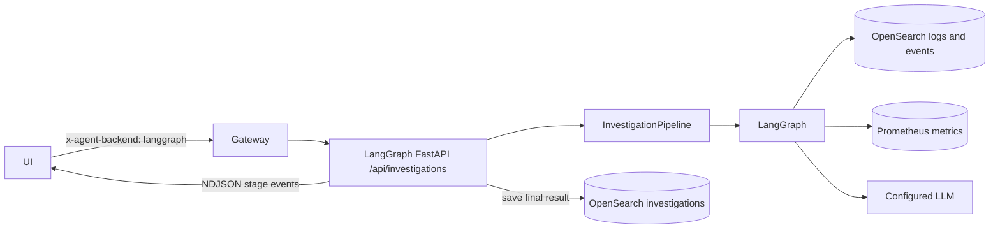
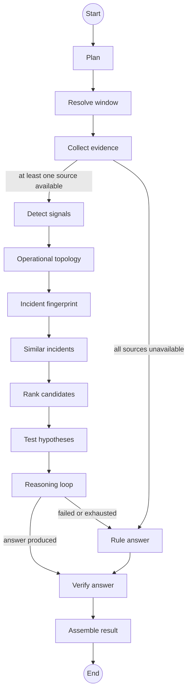

# LangGraph agent: architecture and investigation strategy

This guide describes the implementation in `langgraph-agent/`. It is a separate FastAPI backend that runs the log investigation as a LangGraph state machine. The similarly named `agent/` directory is the other backend and is not the code path described here.

## What it is trying to do

The agent answers operational questions about a registered system using application logs and Kubernetes events from OpenSearch, plus metrics from Prometheus. Its main strategy is **measure first, reason second, verify last**:

1. Interpret the question and validate its scope against the system registry.
2. Choose the time range, detect an incident onset, and find a comparison baseline.
3. Collect and summarize source evidence.
4. Compute signals, observed topology, and an incident fingerprint.
5. Compare prior incidents in the same system and environment, then generate and test current hypotheses.
6. Let an LLM investigate those results with bounded tools and write an answer.
7. Check the answer's references, current-evidence tests, confidence, and known gaps.

The model can write an unsupported claim; the verifier flags or limits it rather than proving every sentence true. Candidate ranking is guidance for the model, and disagreement is visible in the result. It is not a hard constraint on the text the model can produce.

## Where a request goes

The UI sends `x-agent-backend: langgraph`; the gateway forwards that request to the `langgraph-agent` service. In the local Compose file this service listens on container port 8000 and defaults to host port 8001. The service creates clients, tools, the registry, and the pipeline in `app/main.py`. `POST /api/investigations` streams newline-delimited JSON, one `{ "stage": ..., "data": ... }` object per line. The API saves a completed `result` to OpenSearch and adds a `persisted` flag; failure to save does not discard the answer. `GET /api/agent/graph` serves the displayed workflow, and `GET /api/agent/identity` reports the active engine and LLM.

The request fields are `system_id`, `environment`, `question`, and optional `duration`, `start_time`/`end_time`, `service_hint`, `chat_history`, and `thread_id`. An explicit service hint still has to match the registry. A missing `thread_id` starts a new conversation identified by the investigation ID.

## The graph

`app/agents/graph.py` defines `GraphState` and `TOPOLOGY`. The builder compiles nodes and edges from that same declaration, which the UI also displays. `app/agents/nodes.py` implements each stage. `app/pipeline/run.py` creates the graph for each investigation, invokes it with a recursion limit of 32, and holds a process-wide in-memory checkpointer. Bounded thread summaries are also saved in OpenSearch for restart and replica recovery.

| Node | Work performed | Main output |
| --- | --- | --- |
| `plan` | Classify intent, resolve a registered service and duration, select evidence sources. | Validated `InvestigationPlan` and answer mode |
| `windows` | Sweep the requested period, select an incident window and baseline, measure recent status. | Windows, histogram, episodes, current status |
| `evidence` | Gather selected logs, events, and metrics concurrently. | `EvidenceBundle` with source statuses and gaps |
| `signals` | Apply deterministic detection rules to collected evidence. | Time-ordered signals |
| `topology` | Connect observed service calls, pods, nodes, and plausible time-ordered propagation. | Scoped operational graph |
| `fingerprint` | Canonicalize services, signals, sequence, log templates, metric state, and dependencies. | Incident fingerprint |
| `historical_retrieval` | Rank prior incident fingerprints in the same system and environment. | Similar incidents as leads |
| `candidates` | Generate rule-based causes and add low-ranked historical leads only with current signal support. | Candidates with origin, support, and contradictions |
| `hypothesis_testing` | Evaluate expected evidence, contradictions, onset order, and topology from current telemetry. | Keep/reject/uncertain tests and provisional causal roles |
| `reason` | Run a bounded ReAct loop over evidence tools. | Draft answer, exposed evidence IDs, optional table |
| `fallback` | Form a rule-based answer when reasoning cannot run or finish. | Draft answer marked as degraded |
| `verify` | Validate citations, attach measured context, compute confidence. | `StructuredAnswer` |
| `finish` | Build evidence timeline and `InvestigationResult`; append a short conversation memory. | Final result and memory update |

Each run records the nodes it visited in `graph_path`, branch reasons in `graph_decisions`, stage timings, and collection/model errors. Nodes emit progress into an `asyncio.Queue` while the graph runs. The pipeline drains that queue into the HTTP stream, so thoughts, tool calls, and observations can appear before `reason` returns. A `graph` event describing the whole shape is sent first; `llm` usage and `result` events come at the end.

## The investigation strategy in detail

### 1. Plan and scope

`OrchestratorAgent` asks the configured LLM for an intent, service, duration, and short goal. It then validates those values. System identity comes from the request and registry; the model cannot choose a different system. A requested or inferred service must resolve to a known service, otherwise the investigation widens to the whole system and records a note. An explicit valid duration or start/end range takes precedence. If planning fails, keyword heuristics produce a plan.

Intents include incident investigation, health check, performance review, historical query, data extraction, and aggregation. A fixed `INTENT_TOOLS` lookup chooses which of logs, events, and metrics to collect. The intent also maps to an answer mode, so a request for rows or a count is not automatically turned into a root-cause essay.

### 2. Time selection and baseline

`WindowResolver` queries log counts in time buckets over a lookback that can extend before the requested range. It detects sustained elevated error volume and can also use a p95 latency step from Prometheus. It places the baseline before the onset, preferably in a quiet stretch. The baseline is labelled `clean`, `degraded`, or `none`; a degraded baseline means ratios may understate the incident.

There are three different time concepts:

- **Requested/scanned period:** the full period the question asks about. A sweep lists every elevated episode in it.
- **Incident period:** the stretch investigated in depth and compared with the baseline. For extraction and counting questions, the queried incident period covers the full requested range.
- **Recent status period:** a separate fixed recent probe, regardless of when the requested period occurred, used to say whether the system is still affected.

The sweep may find several episodes, but only the primary one receives the full baseline and signal analysis. Secondary episodes are measured and listed; they are not individually diagnosed by this run.

### 3. Evidence collection and signals

`InvestigationPipeline._collect` runs the selected source tools concurrently. `LogTool` supplies counts, normalized log patterns and samples, and observed dependency edges. `EventTool` supplies Kubernetes events. `MetricTool` queries Prometheus for metric series. Collection failures are recorded per source as `unavailable`, with errors and gaps carried into the result. A source that returned no matching data is distinct from a source that could not be reached.

`SignalEngine` detects departures using logs, HTTP metrics, dependency metrics, resource usage, workload lifecycle signals, and events. It attaches evidence IDs and sorts signals by known onset. Thresholds and comparison settings live in `app/config.py`. Examples include error-rate increases, 5xx ratios, latency degradation, traffic surges, CPU or memory pressure, restarts, readiness failures, and dependency trouble. These signals are Python measurements, not numbers invented by the LLM.

### 4. Operational intelligence and historical retrieval

`build_topology` creates service `calls` edges from observed log dependencies and pod `belongs_to`/`runs_on` edges from Kubernetes events and metric labels. It links an upstream service signal to a later caller signal only when an observed dependency edge exists and the lag is at most ten minutes. These links mean *consistent with propagation*, not proven causation. Missing edges and placement data remain unknown.

The fingerprint contains affected services, signal types, their observed order, normalized error/warning templates, metric states relative to baseline, and dependency edges. It is stored with the investigation. Older stored investigations can be compared using the signals and evidence timeline they already contain. Similarity combines signal overlap, ordered sequence, services, log templates, metric state, and topology. Absent features are omitted from the weighted score. A prior RCA does not enter the similarity formula.

Historical retrieval queries the investigations index with exact `plan.system_id` and `plan.environment` filters and checks both again after retrieval. Only completed runs with a measured incident are considered. At most three sufficiently similar results reach the agent, labelled as prior conclusions. A past RCA can also add a low-ranked candidate when a current signal matches that failure type on that service. A match is a lead for current investigation; its old cause is never accepted as current evidence or a current citation.

### 5. Candidate causes, falsification, and causal roles

`HypothesisEngine` applies rules for dependency failure or degradation, memory exhaustion, CPU saturation, startup/readiness/scheduling failures, changes, load increases, and application faults. Each candidate has a cause category, service, rationale, supporting/contradicting signal IDs, onset, and score. Duplicate cause/service pairs are merged. Scoring rewards supporting evidence and causal precedence, penalizes contradictions and an onset after symptoms, and sorts the list for the model. If signals exist but no rule fits, it produces an `unknown` candidate; with no signals it produces a `no_incident` candidate.

`hypothesis_testing` then checks category-specific expected signals, existing support and contradiction IDs, whether the proposed onset precedes symptoms, and whether the observed graph shows plausible propagation. Each check is `observed`, `contradicted`, or `unknown`; absence of a signal is normally unknown. A cause that starts after its supposed effect is rejected. The result classifies current signals provisionally as root-cause evidence, contributing factor, symptom, impact, or consequence. These roles remain heuristic and are stored beside the verified answer.

### 6. Bounded ReAct investigation

`ReActAgent` receives the measured context and uses the project's own `LLMClient` abstraction. It automatically shows the model the signal list at step 0, along with a brief list of multiple episodes when present. Each later step asks for JSON containing a thought, an optional tool action and arguments, and either a next step or a final structured answer. The default limit is eight steps (`REACT_MAX_STEPS`).

The available tools include `get_signals`, `get_hypotheses`, `get_hypothesis_tests`, `get_similar_incidents`, `get_operational_topology`, `get_causal_roles`, `get_dependencies`, `get_timeline`, the log/event/metric readers, `get_episodes`, `get_recent_status`, and `get_investigation_scope`. `fetch_logs`, `logs_around`, and `first_occurrence` can fetch additional bounded log records from OpenSearch, including the resolver's search range before the incident. Current hypothesis tests and available historical leads are shown automatically before the model's first step. Prior incident IDs are not current evidence citation IDs.

The loop discourages repeating the same call or repeatedly searching for nothing. For root-cause answers, it pushes back once if the model tries to conclude without any investigation tool call beyond the seeded signals. Observations are trimmed in the *model transcript* to control prompt size, while full observations are emitted to the UI. A malformed model reply gets a retry within the step budget. Model unavailability, prompt truncation, or running out of steps sends the graph to `fallback`.

### 7. Verification and final result

`verify_answer` builds an index of evidence collected in the run, checks IDs cited by reasoning steps, and labels citations as resolved, unresolved, or inferred by the pipeline. It attaches the measured episode list and recent status independently of what the model wrote. It identifies unmentioned secondary episodes and evidence gaps. It rebuilds confidence using caps and adjustments for missing baselines, partial sources, unsupported claims, invented IDs, model failure, disagreement with the top rule candidate, and a current test that rejects or cannot settle the named cause. Historical similarity never increases confidence. The configured maximum reportable confidence defaults to 0.90.

A crashloop identifies a failing workload, not its exit cause. A rollout at the same reported time is only a lead. When the answer cites no startup log or termination signal for the affected service, verification replaces a claimed root cause with an unconfirmed-exit finding, caps confidence at 0.40, and requests previous-container logs and the termination reason. Live log IDs exposed by the retrieval tools are valid citations.

The final result includes the plan, windows, signals, topology, fingerprint, historical matches, candidates and their tests, causal roles, verified answer, condensed evidence timeline, recent status, source summary, timings, errors, graph path and decisions, and LLM usage. The API stores this record in the OpenSearch investigation index. The flat `analysis` field supports history and evaluation views; `answer` contains the richer structured reasoning and citations.

## Failure behavior and limits

- If every evidence source is marked unavailable, the graph bypasses signal detection and the model loop and produces a degraded rule answer. If only some sources fail, it continues with the available evidence and reports the gaps.
- If the model planner fails, keyword planning can still proceed. If the reasoning loop fails or exhausts its steps, the highest-ranked rule candidate or measured signals form the fallback answer. Verification caps degraded confidence.
- A failure in a stage outside those handled paths can still stop the graph and produce an `error` stream event. For example, window resolution is performed before the evidence collection branch.
- Conversation memory is a bounded LangGraph `memory` channel. It is also saved in the separate `logintel-conversation-memory` OpenSearch index. The checkpoint and stored key include system and environment, so the same client thread ID in another system cannot restore that system's memory. A failure to write durable memory does not fail the answer; the caller's `chat_history` remains a fallback.
- Similarity is a weighted comparison of observed features. It does not measure causal truth, and an old investigation may itself have reached a mistaken conclusion. Current hypothesis tests and citations are the controlling evidence.
- Log patterns, event counts, metric points, ReAct steps, and live log queries are bounded. A result describes the evidence it actually examined; absence of a signal does not prove that no incident occurred outside that scope or below the configured thresholds.
- The implementation can flag unsupported prose and lower confidence, but citation resolution alone does not establish that the cited item causally supports every statement.

## Configuration and code map

| Concern | Main files |
| --- | --- |
| API and dependency construction | `app/main.py`, `app/api/routes.py` |
| Graph, state, routing, streaming | `app/agents/graph.py`, `app/agents/nodes.py`, `app/pipeline/run.py` |
| Planning and LLM reasoning | `app/agents/orchestrator.py`, `app/agents/react.py`, `app/agents/tool_bindings.py` |
| Time, signals, candidates, verification | `app/pipeline/windows.py`, `app/pipeline/signals.py`, `app/pipeline/hypotheses.py`, `app/pipeline/intelligence.py`, `app/pipeline/answer_check.py` |
| Source adapters and storage | `app/tools/`, `app/sources/`, `app/store/investigations.py` |
| Data contracts and settings | `app/models/`, `app/config.py` |
| Tests and evaluation | `tests/`, `eval/run_eval.py` |

The default LLM provider is Ollama. `app/llm/factory.py` also supports OpenAI-compatible, Anthropic, Groq, and Gemini clients. Relevant environment settings include `LLM_PROVIDER`, provider/model URL and key settings, `OLLAMA_NUM_CTX`, `REACT_MAX_STEPS`, `OPENSEARCH_URL`, `PROMETHEUS_URL`, source index names including `OPENSEARCH_MEMORY_INDEX`, baseline/onset thresholds, and `PERSIST_INVESTIGATIONS`. The dependency versions, including LangGraph, are pinned in `langgraph-agent/requirements.txt`.

To inspect the behavior locally, run `python -m pytest tests/test_graph_routing.py tests/test_graph_memory.py tests/test_pipeline.py` from `langgraph-agent/` after installing its requirements. To inspect a running service, call `/api/agent/identity` and `/api/agent/graph`, then submit an investigation and watch its NDJSON stages and final `graph_path`/`graph_decisions`.
